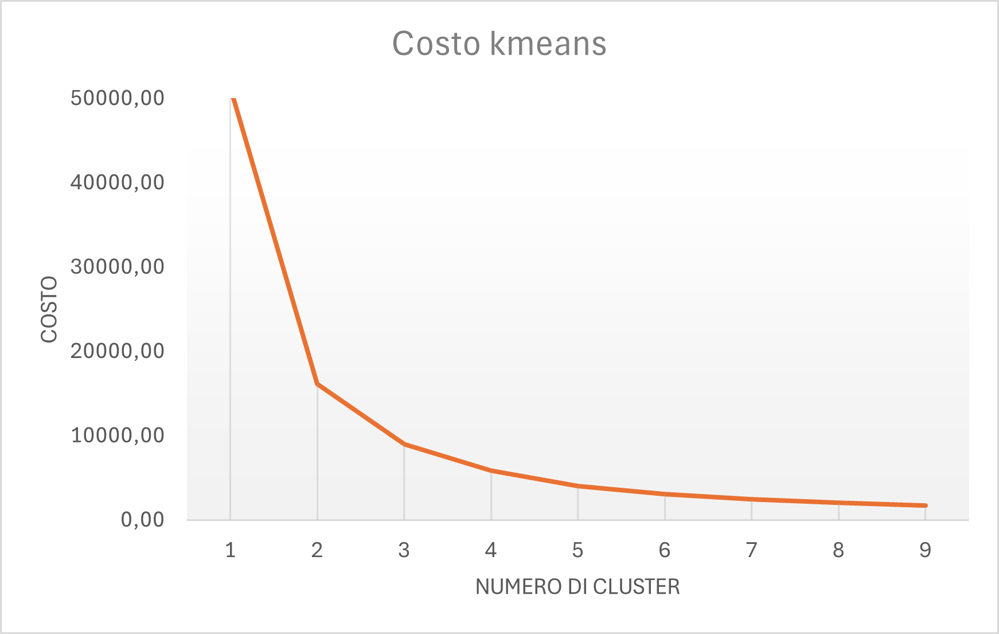
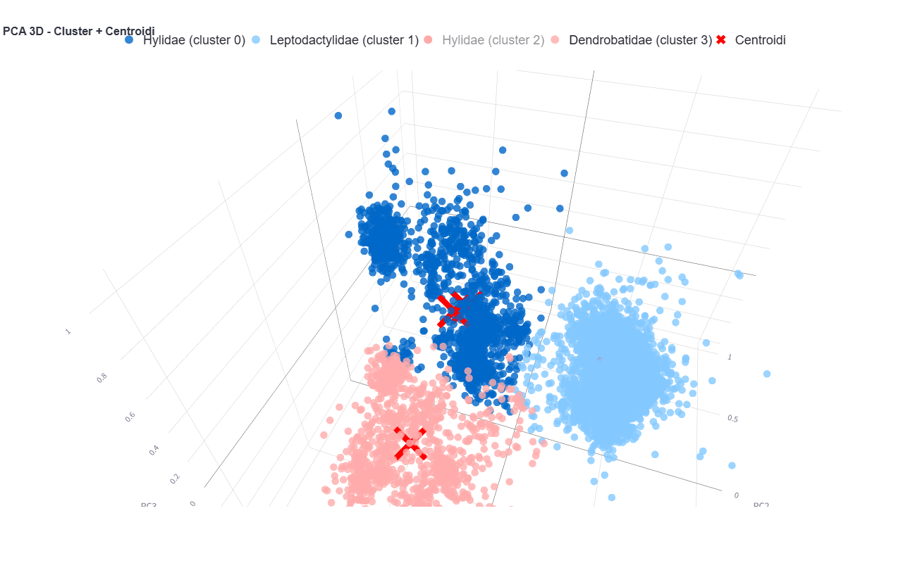
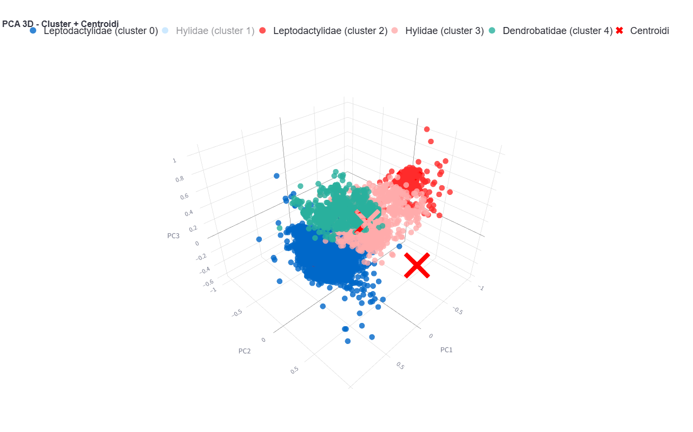

# PCA & Clustering di rane con KMeans

Questo progetto esplora un dataset di **rane** e applica tecniche di **clustering non supervisionato** tramite **KMeans**.  
L'obiettivo è confrontare i cluster generati dall'algoritmo con le classi reali delle rane.

---

## 📊 Dataset

- Ogni **rana** è descritta da **22 feature** quantitative.  
- Ci sono **4 classi di rane** conosciute nel dataset (Family), queste sono Leptodactylidae, Hylidae, Bufonidae e Dendrobatidae.
- Le feature sono state normalizzate/standardizzate prima del clustering.
- [https://archive.ics.uci.edu/dataset/406/anuran+calls+mfccs](Il dataset usato).

---

## 🎯 Obiettivo

- Applicare **KMeans** per raggruppare le rane in cluster.  
- Confrontare i cluster ottenuti con le classi reali delle rane.  
- Visualizzare i dati in **3D** usando **PCA** per ridurre le 22 feature principali a 3 componenti principali.

---

## ⚙️ Pipeline utilizzata

1. **Custom KMeans**: implementazione personalizzata per ottimizzazione dei centroidi.  
2. **PCA a 3 dimensioni**: riduzione della dimensionalità da 22 a 3 componenti principali.  
3. **Generazione grafici**: interattivi in 3D con Plotly e Streamlit.

---

## 🔍 Analisi dei cluster

- È stato usato **l’Elbow Method** per identificare il numero ottimale di cluster.  
- Il miglior risultato è stato ottenuto con **5 cluster**, nonostante ci siano 4 classi:  
- La quarta classe **Bufonidae** non crea un cluster proprio, a causa della **disparità nella dimensione della popolazione** e della **similarità con altre classi**.

---

## 🔄 Passaggio da 4 a 5 cluster

Durante l’analisi del dataset, è stato necessario valutare il numero ottimale di cluster da usare con KMeans.  
Nonostante ci siano **4 classi note**, l’**Elbow Method** suggerisce che il miglior compromesso sia **5 cluster**.  

### 💡 Logica del passaggio

- Con **4 cluster**:
  - Alcune popolazioni di leptociatidi non vengono completamente separate.  
  - I punti si sovrappongono in modo che alcuni cluster risultino meno definiti.
- Con **5 cluster**:
  - Si separa una porzione significativa dei leptociatidi in un cluster a sé.  
  - Gli altri cluster restano coerenti con le classi conosciute.  
- Con **6 cluster** (opzionale da osservare):
  - Un cluster chiaro viene diviso in due, rendendo la segmentazione meno interpretabile.  
- La classe **Bufonidae** non genera un cluster proprio a causa della **disparità di popolazione e della somiglianza con altre classi**.

### 📊 Visualizzazioni

#### Elbow Method

#### PCA 3D con 4 cluster

#### PCA 3D con 5 cluster

Per maggiore chiarezza vè possibile visitare il sito [https://kmeans-pca-visualization.streamlit.app/](https://kmeans-pca-visualization.streamlit.app/), sono presenti i grafici interattivi.

## 🖥️ Contenuto della repository

- `pca_kmeans.py` → App Streamlit interattiva con possibilità di esplorare i risultati di 4, 5 e 6 cluster.
- `pca_results_6cl.pkl` → Risultati PCA + KMeans per **6 cluster**.   
- `pca_results_5cl.pkl` → Risultati PCA + KMeans per **5 cluster**.  
- `pca_results_4cl.pkl` → Risultati PCA + KMeans per **4 cluster**.  
- `requirements.txt` → Librerie necessarie per eseguire l’app.

---

## 🌐 Visualizzazione online

I grafici sono disponibili direttamente online senza download:  
[https://kmeans-pca-visualization.streamlit.app/](https://kmeans-pca-visualization.streamlit.app/)  

È possibile osservare come cambia il clustering con **4, 5 o 6 cluster**.

